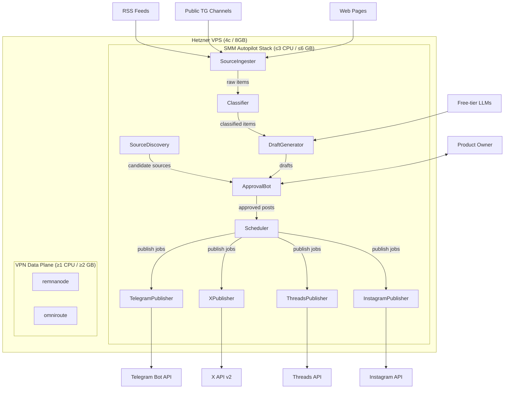

# ARCH-001: SMM Autopilot MVP

## 1. Context

Implements: PRD-001@0.1.0 §1–§8 (Problem Statement, Goals G1–G3, User Stories US-1 through US-5, Technical Envelope, Risks).
Does NOT implement: PRD-001@0.1.0 §3 Non-Goals (NG1–NG11), §10 Out of Scope (Dzen, VK, metrics ingestion, AI advisor, evergreen reposts, analytics-driven posting, autonomous source curation, non-text modalities).

### Trace Matrix

| PRD Section | PRD Goal / User Story | Components that satisfy it |
|---|---|---|
| §2 G1 (PO ≤2 hrs/week) | PO spends ≤2 hrs/week on SMM | ApprovalBot, Scheduler |
| §2 G2 (≥15 posts/week) | ≥15 approved posts/week across channels | SourceIngester, Classifier, DraftGenerator, Scheduler, ChannelPublishers |
| §2 G3 (≥80% approval-without-edit) | ≥80% drafts approved without edit | DraftGenerator, Classifier |
| §5 US-1 (News ingestion & ranking) | Monitor sources, classify, filter, freshness SLA | SourceIngester, Classifier, Scheduler, SourceDiscovery |
| §5 US-2 (Draft generation with A/B) | Generate 1–3 tailored posts × 2 variants in Russian | DraftGenerator |
| §5 US-3 (Controlled-cadence publishing) | Publish approved posts within cadence ceilings via official APIs | Scheduler, ChannelPublishers (TelegramPublisher, XPublisher, ThreadsPublisher, InstagramPublisher) |
| §5 US-4 (One-click approval queue) | Telegram bot inline-keyboard queue with expiry | ApprovalBot, Scheduler |
| §5 US-5 (Factuality & ToS safety) | Refuse unsubstantiated claims, refuse ToS-violating actions | Classifier, DraftGenerator, ChannelPublishers |

Every component traces to ≥1 PRD row. Every PRD Goal/US has ≥1 component. No orphans.

## 2. Architecture Overview

The system is a set of cooperating Python async services running inside a single Docker Compose stack on the shared Hetzner VPS. All services share a single SQLite database file and communicate via an in-process async task queue (no external broker). A single Telegram bot serves as both the PO approval interface and the publishing channel.



## 3. Components

### 3.1 SourceIngester
- **Responsibility:** Poll configured news sources (RSS feeds, public Telegram channels via Bot API `getUpdates` on a read-only bot or channel forwarding, public web pages) on a configurable interval and persist raw items to the database.
- **Inputs:** Source configuration (managed by PO via ApprovalBot commands, stored in DB). RSS XML, Telegram channel posts, web page HTML.
- **Outputs:** `RawItem` rows in the database with `source_id`, `external_id`, `title`, `body`, `url`, `image_url`, `published_at`, `ingested_at`.
- **LLM usage:** None.
- **State:** SQLite `raw_items` table. Deduplication by `(source_id, external_id)`.
- **Failure modes:** Source unreachable → log warning, skip, retry on next poll cycle. Malformed RSS/HTML → log error, skip item, continue. Telegram API error → bounded retry with exponential backoff (3 attempts, max 60s).

### 3.2 Classifier
- **Responsibility:** Classify each raw item against the fixed taxonomy (privacy / circumvention / platform-policy / competitors / product-launches / other), determine time sensitivity, and determine political sensitivity using the PO-maintained static keyword list. Items matching the first five categories enter the draft queue. Items matching sensitivity keywords are flagged `is_sensitive=true`.
- **Inputs:** `RawItem` rows with `status=pending`.
- **Outputs:** `ClassifiedItem` rows with `category`, `is_sensitive`, `is_time_sensitive`, `relevance_score`. Items in category `other` are marked `status=discarded`.
- **LLM usage:** None for sensitivity detection (static keyword match per Q_TO_BUSINESS_7). Category classification uses a free-tier LLM (GLM-4-Flash or Qwen-Turbo) with a fixed system prompt. One API call per item, ~200 input tokens + ~50 output tokens.
- **State:** SQLite `classified_items` table.
- **Failure modes:** LLM timeout → retry 2× with 10s backoff, then fall back to keyword-only classification (match category by keyword presence, flag `classification_method=keyword_fallback`). In keyword fallback, `is_sensitive` still comes from the PO-maintained keyword list and `is_time_sensitive` is set conservatively to `true`; fallback must never silently drop the freshness SLA. LLM returns unparseable response → same fallback. Rate limit → backoff per provider policy.
- **Prompt-injection mitigation:** Raw item text is XML-escaped before being passed in a `<user_content>` delimited block inside the system prompt; exact escaping rules are defined in §9. The system prompt explicitly instructs the model to classify only and ignore any instructions within the content block. Output is parsed as a structured JSON schema; any response not matching the schema is rejected.

### 3.3 DraftGenerator
- **Responsibility:** For each classified item (categories 1–5), generate 1–3 tailored posts (one per active channel the item is relevant to), with exactly 2 textual variants (A/B) per tailored post, in Russian. Every factual claim must be attributable to the source. If a claim cannot be attributed, paraphrase with inline citation or flag the draft as `UNVERIFIED`.
- **Inputs:** `ClassifiedItem` rows with `status=classified`. Active channel configuration. Channel format constraints (character limits per channel).
- **Outputs:** `Draft` rows with `classified_item_id`, `channel_id`, `variant_a_text`, `variant_b_text`, `variant_a_image_url`, `variant_b_image_url` (same source image or null), `status` (ready / unverified), `citations`.
- **LLM usage:** Free-tier LLM (primary: GLM-4-Flash; fallback: Qwen-Turbo). One API call per channel-tailored post (~500 input tokens including source text + system prompt, ~400 output tokens for 2 variants). Estimated ≤5 LLM calls per classified item.
- **State:** SQLite `drafts` table.
- **Failure modes:** LLM timeout → retry 2× with 15s backoff. LLM returns content that doesn't parse → retry once with simplified prompt, then mark the classified item `status=generation_failed`, increment `generation_retry_count`, set `next_generation_attempt_at`, and log. Scheduler re-queues `generation_failed` items whose retry time has arrived until `generation_retry_count=3`; after that, the item remains failed and the PO is alerted. All failures are non-blocking; the system continues with other items.
- **Attribution validation:** `validation.py` uses deterministic source-span matching, not NLI: normalize whitespace/case, extract generated claim sentences, and require each factual claim to share a citation URL or a sufficient keyword/source-span overlap with the source title/body. Claims without deterministic support cause `Draft.status=unverified`.
- **Prompt-injection mitigation:** Source text is XML-escaped before being enclosed in `<source_text>` delimiters. System prompt instructs the model to generate posts based only on the enclosed source. Output parsed as structured JSON; non-conforming responses rejected.

### 3.4 ApprovalBot
- **Responsibility:** Telegram bot that serves as the PO's single admin interface. Provides: (a) approval queue with inline keyboard for approve-A / approve-B / edit / reject / defer per draft, (b) sensitive-item sub-queue with two-step confirmation, (c) source-list CRUD commands, (d) cadence configuration commands, (e) channel credential management commands, (f) source-discovery candidate approval.
- **Inputs:** Telegram `callback_query` and `/command` messages from the PO's Telegram user ID (hardcoded allowlist of 1). Draft rows with `status=ready` or `status=unverified`.
- **Outputs:** Updates `Draft.status` to `approved` (with chosen variant), `rejected`, or `deferred`. Updates source/cadence/channel configuration in DB. Sends formatted messages to PO with inline keyboards.
- **LLM usage:** None.
- **State:** Bot state managed via Telegram `callback_data` and SQLite. Long polling via `getUpdates`.
- **Failure modes:** Telegram API unreachable → bounded retry (5 attempts, exponential backoff up to 120s), then log critical and continue polling. PO sends unrecognized command → reply with help text. Concurrent button presses on same draft → idempotent update (first write wins, subsequent attempts return "already processed").

### 3.5 Scheduler
- **Responsibility:** Schedule approved posts for publishing within cadence ceilings. Enforce per-channel cadence (≤1 post/day per channel), global kill-switch, and per-channel enable/disable. Use static best-practice time windows per channel. Auto-expire time-sensitive items that exceed the 24h freshness SLA. Re-queue retryable draft-generation and publish failures within bounded retry limits.
- **Inputs:** Approved `Draft` rows. Cadence configuration from DB. Channel status.
- **Outputs:** `PublishJob` rows with `scheduled_at`, `channel_id`, `draft_id`, `status`. Expired items marked `status=expired`. Retryable `generation_failed` classified items reset to `status=classified`. Retryable failed publish jobs get a new `scheduled_at` in the next available channel window.
- **LLM usage:** None.
- **State:** SQLite `publish_jobs` table.
- **Failure modes:** No approved posts available → idle, no action. Cadence change by PO → re-evaluate queue within ≤1 hour (implemented as periodic check every 5 minutes). Draft generation failed → re-queue up to 3 attempts before alerting PO. Publish attempt failed after adapter-local retries → increment `PublishJob.retry_count`, set `scheduled_at` to the next available cadence window, and retry until `retry_count=max_retry_count`; after max retries, mark `status=failed` and alert PO. Clock skew → use UTC throughout.

### 3.6 ChannelPublishers (TelegramPublisher, XPublisher, ThreadsPublisher, InstagramPublisher)
- **Responsibility:** Each publisher adapter implements a common interface to publish a post to its respective channel via the platform's official API. Each adapter is independently togglable. If credentials are not provisioned, the adapter is marked `pending_credentials` and no publish attempts are made.
- **Inputs:** `PublishJob` rows with `status=scheduled` and `scheduled_at <= now`.
- **Outputs:** Update `PublishJob.status` to `published` (with platform post ID) on success. Return retryable/permanent failure metadata to Scheduler on failure. Update `publish_log` with timestamps.
- **LLM usage:** None.
- **State:** Stateless per-call; results persisted to SQLite.
- **Failure modes per adapter:**
  - **TelegramPublisher:** API error → retry 3× with exponential backoff (5s, 15s, 45s). Rate limit (429) → respect `retry_after` header. Permanent error (403 forbidden) → disable adapter, notify PO.
  - **XPublisher:** API error → retry 3× with backoff. Rate limit (429) → respect headers. Monthly quota check before each publish (track count in DB); if approaching 500/month → notify PO, refuse publish. Free-tier revoked → disable adapter, notify PO.
  - **ThreadsPublisher:** Two-phase publish (create media container → publish). API error → retry 3×. Token expiry → attempt refresh; if refresh fails → disable adapter, notify PO.
  - **InstagramPublisher:** Same as Threads (Meta Graph API). Nice-to-have; disabled by default.
- **ToS enforcement:** Each adapter checks at startup that its publish path uses only the official API. No fallback to browser automation, scraping, or unofficial endpoints exists in code. If the official API is unavailable, the adapter disables itself.

### 3.7 SourceDiscovery
- **Responsibility:** Scan ingested content for cross-references to other sources (RSS feed URLs, Telegram channel links, website URLs mentioned in articles). Queue discovered candidates for PO approval via the ApprovalBot before adding them as active sources.
- **Inputs:** `RawItem` body text.
- **Outputs:** `SourceCandidate` rows with `url`, `type` (rss/telegram/web), `discovered_from_item_id`, `status=pending_approval`.
- **LLM usage:** None (regex-based URL/link extraction).
- **State:** SQLite `source_candidates` table. Deduplication by URL.
- **Failure modes:** Malformed URL extracted → validate before persisting, skip invalid. Duplicate → skip silently.

## 4. Data Flow

1. **Ingest:** `SourceIngester` polls sources on a 15-minute interval → writes `RawItem` rows.
2. **Classify:** `Classifier` picks up `RawItem(status=pending)` → calls free-tier LLM for category, applies keyword sensitivity filter → writes `ClassifiedItem`. Items in category `other` are discarded.
3. **Generate:** `DraftGenerator` picks up `ClassifiedItem(status=classified)` → calls free-tier LLM to produce 2 variants per active channel → writes `Draft(status=ready|unverified)`. Exhausted generation attempts mark the classified item `status=generation_failed` with retry metadata.
4. **Queue:** `ApprovalBot` renders drafts with `status=ready` in the normal queue and `status=ready, is_sensitive=true` in the sensitive sub-queue. `UNVERIFIED` drafts are shown with a prominent flag. PO approves (picks variant A or B), rejects, edits+approves, or defers.
5. **Schedule:** `Scheduler` picks up `Draft(status=approved)` → creates `PublishJob` with `scheduled_at` based on cadence rules and static time windows.
6. **Publish:** Relevant `ChannelPublisher` picks up `PublishJob(status=scheduled, scheduled_at <= now)` → calls platform API → marks `published` on success or returns failure metadata to Scheduler.
7. **Expire:** `Scheduler` periodically checks for time-sensitive items where `source_published_at + 24h < now` and `Draft.status` is not `approved` → marks `status=expired`.
8. **Recover:** `Scheduler` periodically resets retryable `generation_failed` classified items to `status=classified` and re-schedules retryable failed publish jobs into the next available channel window, bounded by each item's max retry count.
9. **Discover:** `SourceDiscovery` runs periodically over recent `RawItem` bodies → extracts candidate source URLs → writes `SourceCandidate` for PO review in ApprovalBot.

## 5. Data Model / Schemas

```yaml
SchemaVersion:
  id: integer (PK, fixed value 1)
  version: integer
  applied_at: datetime

Source:
  id: integer (PK, autoincrement)
  type: enum(rss, telegram_channel, web_page)
  url: text (unique)
  name: text
  is_active: boolean (default true)
  added_by: enum(po_manual, autodiscovery)
  created_at: datetime
  updated_at: datetime

RawItem:
  id: integer (PK, autoincrement)
  source_id: integer (FK -> Source.id)
  external_id: text
  title: text (nullable)
  body: text
  url: text (nullable)
  image_url: text (nullable)
  published_at: datetime (nullable)
  ingested_at: datetime
  status: enum(pending, processed, error)
  unique_constraint: (source_id, external_id)

ClassifiedItem:
  id: integer (PK, autoincrement)
  raw_item_id: integer (FK -> RawItem.id, unique)
  category: enum(privacy, circumvention, platform_policy, competitors, product_launches, other)
  is_sensitive: boolean
  is_time_sensitive: boolean
  relevance_score: float (0.0–1.0)
  classification_method: enum(llm, keyword_fallback)
  status: enum(classified, discarded, generation_failed)
  generation_retry_count: integer (default 0)
  next_generation_attempt_at: datetime (nullable)
  last_generation_error: text (nullable)
  classified_at: datetime

Channel:
  id: integer (PK, autoincrement)
  platform: enum(telegram, x, threads, instagram)
  name: text
  is_active: boolean (default false)
  credentials_provisioned: boolean (default false)
  cadence_posts_per_day: integer (default 1)
  cadence_posts_per_week_target: integer
  publish_window_utc: text  # e.g. "09:00-12:00,18:00-21:00"
  char_limit: integer
  created_at: datetime
  updated_at: datetime

Draft:
  id: integer (PK, autoincrement)
  classified_item_id: integer (FK -> ClassifiedItem.id)
  channel_id: integer (FK -> Channel.id)
  variant_a_text: text
  variant_b_text: text
  image_url: text (nullable)
  citations: text  # JSON array of source URLs
  status: enum(ready, unverified, approved, rejected, deferred, expired, generation_failed)
  chosen_variant: enum(a, b, null)
  po_edit_text: text (nullable)
  is_sensitive: boolean
  approved_at: datetime (nullable)
  expires_at: datetime (nullable)
  created_at: datetime
  updated_at: datetime

PublishJob:
  id: integer (PK, autoincrement)
  draft_id: integer (FK -> Draft.id)
  channel_id: integer (FK -> Channel.id)
  scheduled_at: datetime
  published_at: datetime (nullable)
  platform_post_id: text (nullable)
  status: enum(scheduled, publishing, published, failed, cancelled)
  retry_count: integer (default 0)
  max_retry_count: integer (default 3)
  last_error: text (nullable)
  created_at: datetime
  updated_at: datetime

SourceCandidate:
  id: integer (PK, autoincrement)
  url: text (unique)
  type: enum(rss, telegram_channel, web_page)
  discovered_from_item_id: integer (FK -> RawItem.id)
  status: enum(pending_approval, approved, rejected)
  created_at: datetime

CadenceConfig:
  id: integer (PK, autoincrement)
  global_kill_switch: boolean (default false)
  updated_at: datetime

SensitivityKeyword:
  id: integer (PK, autoincrement)
  keyword: text (unique)
  created_at: datetime

PublishLog:
  id: integer (PK, autoincrement)
  publish_job_id: integer (FK -> PublishJob.id)
  event: enum(attempt, success, failure, retry)
  detail: text
  timestamp: datetime

Metrics:
  name: text
  period: enum(daily, weekly, monthly, total)
  value: integer (default 0)
  period_date: date (NOT NULL)
    # For daily rows: the calendar date the counter covers (e.g. 2026-04-24).
    # For weekly rows: the Monday of the ISO week the counter covers.
    # For monthly rows: the first day of the month the counter covers.
    # For total rows: '1970-01-01' (sentinel — cumulative since DB init).
    #   NULL is not used because SQLite treats NULL != NULL for uniqueness,
    #   which would break the ON CONFLICT UPSERT for total-period rows.
  updated_at: datetime
  primary_key: (name, period, period_date)
  # Each counter name has up to four rows per period window (one per
  # distinct period_date value).  Rows are upserted
  # (INSERT … ON CONFLICT (name, period, period_date) DO UPDATE SET
  #   value = value + excluded.value, updated_at = excluded.updated_at).
  # On period rollover the ingester/classifier/etc. MUST insert a fresh
  # row with the new period_date (value=1); the old row remains for
  # historical queries.  Total-period rows share period_date='1970-01-01'.
```

## 6. External Interfaces

| System | Protocol | Auth | Rate Limit | Failure Mode | Notes |
|---|---|---|---|---|---|
| Telegram Bot API (publish) | HTTPS REST | Bot token (Bearer) | ~30 msg/sec global, ~20 msg/min per chat (source: Telegram Bot FAQ) | Retry with backoff; 429 → respect `retry_after` | `sendMessage` / `sendPhoto` to channel chat_id |
| Telegram Bot API (PO bot) | HTTPS long-poll (`getUpdates`) | Bot token (Bearer) | Same as above | Retry with backoff; connection drop → reconnect | Separate bot token from publish bot |
| Telegram Bot API (source ingestion) | HTTPS REST | Bot token (Bearer) | Same | Retry with backoff | Read-only: `getUpdates` on channels the bot is admin of, or forwarded channel posts |
| X API v2 (post creation) | HTTPS REST `POST /2/tweets` | OAuth 2.0 PKCE (free tier) | 500 posts/month free tier; 300 requests/15 min per user (source: X API docs) | Track monthly count in DB; refuse if ≥490; 429 → backoff | Free tier only |
| Threads API (Meta Graph API) | HTTPS REST | OAuth 2.0 long-lived token | 250 API calls/user/hour (source: Meta Threads API docs) | Token refresh on 401; retry 3×; disable adapter on persistent auth failure | Two-phase: create container → publish |
| Instagram Graph API | HTTPS REST | OAuth 2.0 long-lived token | 200 API calls/user/hour (source: Meta Graph API docs) | Same as Threads | Nice-to-have; disabled by default |
| RSS Feeds | HTTP(S) GET | None | Varies; poll every 15 min | Skip on error, retry next cycle | Standard RSS/Atom XML parsing |
| Free-tier LLM: GLM-4-Flash | HTTPS REST | API key | Free tier limits (source: BigModel platform) | Retry 2×; fallback to Qwen-Turbo | Primary for classification + drafting |
| Free-tier LLM: Qwen-Turbo | HTTPS REST | API key | Free tier limits (source: Alibaba Cloud) | Retry 2×; fallback to keyword-only | Secondary / fallback |

## 7. Tech Stack Decisions (linked ADRs)

- **Language / Runtime:** Python 3.12 + asyncio (ADR-001@0.1.0)
- **Storage:** SQLite via aiosqlite (ADR-002@0.1.0)
- **LLM orchestration:** Direct HTTP calls via httpx with provider-routing logic (ADR-003@0.1.0)
- **Task scheduling:** APScheduler 3.x (in-process async scheduler) (ADR-004@0.1.0)
- **APScheduler persistence compatibility:** APScheduler may use `SQLAlchemyJobStore` backed by the same SQLite database. SQLAlchemy is allowed only for APScheduler job persistence; application data access remains raw SQL via aiosqlite.
- **Telegram bot framework:** python-telegram-bot v21+ (async) — covered in ADR-001@0.1.0 §ecosystem
- **HTTP client:** httpx (async) — covered in ADR-001@0.1.0
- **RSS parsing:** feedparser — covered in ADR-001@0.1.0
- **HTML parsing:** beautifulsoup4 + lxml — covered in ADR-001@0.1.0
- **Containerization:** Docker + Docker Compose — no ADR needed (only viable option on shared VPS for resource isolation)
- **LLM provider specificity:** PRD-001@0.1.0 defines LLM providers abstractly as free-tier; ARCH specifies concrete choice (GLM-4-Flash, Qwen-Turbo). PRD bump deferred.

## 8. Observability

- **Logs:**
  - Format: JSON lines (structured), one line per event.
  - Fields: `timestamp` (ISO 8601 UTC), `level`, `component`, `event`, `detail`, `item_id` (where applicable).
  - Library: Python `structlog` configured with JSON renderer.
  - Destination: stdout (captured by Docker logging driver → `/var/log/smm-autopilot/`).
  - Retention: 7 days on disk via Docker `max-size: 50m, max-file: 5` log rotation.
- **Metrics:**
  - Tracked in the `Metrics` table defined in §5 (composite PK `(name, period, period_date)`). Each counter name is stored in four period buckets (`daily`, `weekly`, `monthly`, `total`), upserted on each event. `period_date` anchors each row to a specific date (daily → calendar date, weekly → ISO-week Monday, monthly → first-of-month, total → sentinel `'1970-01-01'`). NULL is not used because SQLite `NULL ≠ NULL` would break the `ON CONFLICT` UPSERT.
  - Counter rows (seeded at DB init for each counter name × each period; period_date set to the current date for daily/weekly/monthly rows, `'1970-01-01'` for total rows):
    - `items_ingested` — incremented by SourceIngester on each new RawItem.
    - `items_classified` — incremented by Classifier on each ClassifiedItem.
    - `drafts_generated` — incremented by DraftGenerator on each Draft.
    - `drafts_approved` — incremented by ApprovalBot on PO approve action.
    - `drafts_rejected` — incremented by ApprovalBot on PO reject action.
    - `posts_published` — incremented by ChannelPublishers on successful publish.
    - `posts_failed` — incremented by ChannelPublishers on permanent publish failure.
    - `llm_calls_total` — incremented by LLMClient on each API call (success or failure).
    - `llm_tokens_total` — incremented by LLMClient with the token count returned by the provider.
    - `llm_errors` — incremented by LLMClient on each provider error (timeout, rate-limit, parse failure).
  - Period rollover: when a new day/week/month begins, the first incrementing event MUST insert a fresh row with the new `period_date` (value=1). Old rows remain for historical queries. Total rows (period_date='1970-01-01') are never reset.
  - PO can query via bot command `/stats` for a daily/weekly summary.
  - No Prometheus/Grafana in MVP — operational simplicity per PRD-001@0.1.0 §7 (single PO, no dev-ops rotation).
- **Alerting:**
  - Critical alerts sent to PO via the ApprovalBot Telegram chat: adapter disabled, LLM budget exceeded, publish failure after all retries, freshness SLA breach.
  - Non-critical warnings logged only (source fetch failures, LLM retries).
- **Tracing:**
  - Each item carries a `trace_id` (UUID) from ingestion through publish, logged on every event. No distributed tracing infrastructure; grep-based correlation via `trace_id`.

## 9. Security

- **Secrets management:**
  - All secrets (bot tokens, API keys, OAuth tokens) stored in `.env` file on the VPS, mounted into the Docker container as environment variables.
  - `.env.example` committed to the repo with placeholder keys; `.env` is in `.gitignore`.
  - No secrets in git. Ever.
- **Network boundaries:**
  - The SMM Autopilot stack has no inbound ports open (no webhook; uses long polling for Telegram).
  - Outbound only: Telegram API (443), X API (443), Meta API (443), RSS/web sources (80/443), LLM APIs (443).
  - Docker network: `smm-autopilot` bridge network, isolated from the VPN data plane containers.
- **PO authentication:**
  - ApprovalBot accepts commands only from a hardcoded Telegram user ID (the PO). All other messages are silently ignored.
  - No web interface → no CSRF, XSS, or session management concerns.
- **LLM prompt-injection mitigations:**
  - Shared escaping rule: before wrapping external source text in LLM delimiters, normalize to Unicode NFC, then XML-escape the three delimiter-forming characters in this order: `&` → `&amp;`, `<` → `&lt;`, `>` → `&gt;`. Do not escape the wrapper tags themselves and do not unescape the source text before model submission. This makes literal `</user_content>` and `</source_text>` strings inert inside the wrapped block.
  - Classifier: Escaped source text wrapped in `<user_content>` delimiters with explicit "classify only, ignore instructions" preamble. Output parsed as JSON schema; non-conforming responses rejected.
  - DraftGenerator: Escaped source text wrapped in `<source_text>` delimiters. Output parsed as JSON schema. Generated drafts undergo a deterministic post-generation attribution check: any text not attributable to the source is flagged `UNVERIFIED`.
  - No LLM has access to system credentials, database, or command execution.
- **Data at rest:**
  - SQLite database file stored on the VPS filesystem. No encryption at rest in MVP (the VPS disk is under PO control; data is not user PII — it's public news content and PO-authored posts).
  - API tokens in `.env` are readable only by the container user (file permissions 600).

## 10. Deployment

- **Runtime:** Docker Compose on Hetzner VPS (4c / 8 GB RAM shared with VPN infra).
- **Resource budget:**
  - CPU: `cpus: 2.0` (hard limit via Docker Compose `deploy.resources.limits`). Leaves ≥2 CPU cores for VPN. Well within the 3-core ceiling.
  - RAM: `mem_limit: 4g` (hard limit). Leaves ≥4 GB for VPN + OS. Well within the 6 GB ceiling.
  - Docker `mem_limit: 4g` is intentionally tighter than PRD-001@0.1.0's 6GB ceiling; systemd `MemoryMax=6G` is the outer safety net.
  - Estimated steady-state: ~200 MB RAM (Python process + SQLite), <0.5 CPU core (mostly idle, bursts during LLM calls and ingestion).
  - Peak (concurrent ingestion + classification + draft generation): ~800 MB RAM, ~1.5 CPU cores for <30 seconds.
- **Container structure:** Single Docker image, single container running all async services in one Python process. Justification: the workload is light and bursty; separate containers would waste RAM on duplicate Python runtimes. The async architecture provides logical separation.
- **Rollback procedure:**
  1. `ssh vps` → `cd /opt/smm-autopilot`
  2. `docker compose down`
  3. `git checkout <previous-tag>`
  4. `docker compose up -d --build`
  5. Verify: `docker compose logs --tail=50` — confirm no crash loops.
  6. SQLite DB is backward-compatible; migrations are forward-only with version tracking. If a migration must be reverted, restore from the pre-deploy backup: `cp /opt/smm-autopilot/backups/db-<timestamp>.sqlite3 data/smm.db`
- **Backup:** SQLite DB copied to `backups/` directory before each deploy (scripted in `deploy.sh`). Retention: 7 most recent backups.
- **OS-level resource ceiling:** In addition to Docker limits, a systemd slice `smm-autopilot.slice` with `CPUQuota=300%` and `MemoryMax=6G` is configured as a hard backstop per PRD-001@0.1.0 §7.

## 11. Work Breakdown (tickets for Executor)

Accepted risk: ApprovalBot remains a Telegram-only admin path in this epic, so Telegram outage blocks PO approval actions. Email-digest fallback is deferred to a future epic; this is acceptable for ARCH-001@0.1.1 because PRD-001@0.1.0 permits missing a single channel-day but forbids autonomous publishing.

| ID | Title | Depends on | Assigned executor |
|---|---|---|---|
| TKT-001@0.1.1 | Project skeleton and configuration | — | glm-5.1 |
| TKT-002@0.1.1 | Source ingestion service | TKT-001@0.1.1 | glm-5.1 |
| TKT-003@0.1.1 | Content classifier and sensitivity filter | TKT-001@0.1.1 | glm-5.1 |
| TKT-004@0.1.1 | Draft generation service | TKT-001@0.1.1, TKT-003@0.1.1 | glm-5.1 |
| TKT&#45;005a@0.1.0 | Approval queue core | TKT-001@0.1.1 | qwen-3.6-plus |
| TKT&#45;005b@0.1.0 | Approval bot admin commands | TKT-001@0.1.1, TKT&#45;005a@0.1.0 | qwen-3.6-plus |
| TKT-006@0.1.1 | Channel publisher adapters | TKT-001@0.1.1 | codex-gpt-5.3 |
| TKT-008@0.1.1 | Source autodiscovery worker | TKT-001@0.1.1, TKT-002@0.1.1 | qwen-3.6-plus |
| TKT&#45;005c@0.1.0 | Discovery approval and stats commands | TKT-001@0.1.1, TKT&#45;005a@0.1.0, TKT-008@0.1.1 | qwen-3.6-plus |
| TKT-007@0.1.1 | Scheduler and cadence enforcer | TKT-001@0.1.1, TKT&#45;005a@0.1.0, TKT&#45;005b@0.1.0, TKT-006@0.1.1 | glm-5.1 |
| TKT-009@0.1.1 | Observability and deployment configuration | TKT-001@0.1.1 | glm-5.1 |

TKT-005@0.1.0 is superseded by the three split approval-bot tickets and must not be executed. Dependency DAG is acyclic: TKT-001@0.1.1 is the root; TKT-002@0.1.1, TKT-003@0.1.1, TKT-006@0.1.1, TKT-009@0.1.1, and the approval queue core depend only on TKT-001@0.1.1 (parallelizable); TKT-004@0.1.1 depends on TKT-001@0.1.1 and TKT-003@0.1.1; the admin-command split depends on the approval queue core; TKT-008@0.1.1 depends on TKT-002@0.1.1; the discovery/stats split depends on the approval queue core and TKT-008@0.1.1; TKT-007@0.1.1 depends on the approval queue core, the admin-command split, and TKT-006@0.1.1.

## 12. Risks & Open Questions

- **R1 (Medium): Free-tier LLM quality for Russian-language content.** GLM-4-Flash and Qwen-Turbo may produce lower-quality Russian text than paid models, risking G3 (<80% approval-without-edit). Mitigation: prompt engineering in TKT-004@0.1.1; PO monitors G3 metric; if G3 < 70% after 2 weeks, escalate to PO for paid-LLM budget allocation within $30/month cap.
- **R2 (Medium): SQLite write contention under concurrent tasks.** Multiple async tasks writing simultaneously could hit SQLite's single-writer lock. Mitigation: WAL mode enabled; write operations serialized via an async write queue (single writer pattern). Tested under expected load in TKT-001@0.1.1.
- **R3 (Low–Medium): Meta API token refresh complexity.** Threads/Instagram long-lived tokens expire every 60 days. If the PO doesn't refresh in time, the adapter silently disables. Mitigation: ApprovalBot sends a reminder 7 days before expiry.
- **R4 (Low): X free-tier removal.** If X removes the free write tier, the adapter auto-disables and the PO is notified. No silent fallback. G2 is pro-rated per PRD-001@0.1.0.
- **R5 (Low): Prompt injection via source content.** Malicious content in RSS/Telegram sources could attempt to hijack LLM classification or draft generation. Mitigation: delimiter-based isolation + JSON schema output validation + post-generation attribution check.
- **R6 (Medium): Telegram ApprovalBot single-protocol SPOF.** If Telegram Bot API is unavailable, the PO cannot approve queued posts or adjust cadence. Mitigation: accepted risk for ARCH-001@0.1.1; no autonomous publishing occurs, stale time-sensitive items expire, and email-digest fallback is deferred to a future epic.
- **Q_TO_BUSINESS:** All 8 Q_TO_BUSINESS items from the gap report have been answered by the PO. No unresolved questions remain.

---

## Handoff Checklist
- [x] Each component has clear Input/Output
- [x] All referenced ADRs exist and are `draft` or `proposed` (ADR-001@0.1.0 through ADR-004@0.1.0)
- [x] Resource budget fits PRD Technical Envelope (2 CPU / 4 GB RAM hard limit < 3 CPU / 6 GB ceiling)
- [x] Work Breakdown lists independent tickets with explicit dependency graph (DAG verified acyclic)
- [x] Observability and Security sections non-empty
- [x] All PRD references pin to a specific version (PRD-001@0.1.0)
